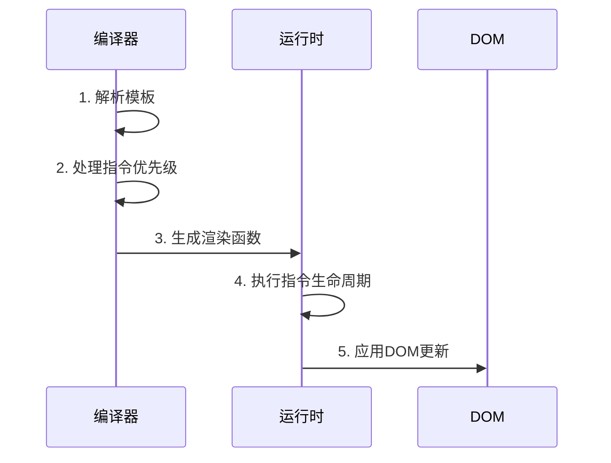
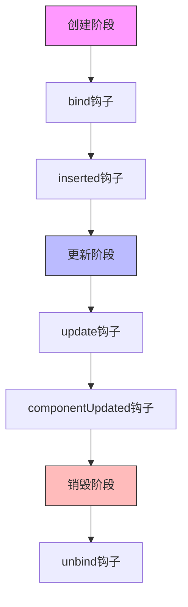

# Vue 2.6.14 内置指令实现文档

## 目录

- [指令概述](#指令概述)
- [指令分类与实现](#指令分类与实现)
  - [结构性指令](#结构性指令)
  - [属性绑定指令](#属性绑定指令)
  - [事件处理指令](#事件处理指令)
  - [渲染优化指令](#渲染优化指令)
  - [其他指令](#其他指令)
- [指令优先级和执行顺序](#指令优先级和执行顺序)
- [指令生命周期](#指令生命周期详解)
- [性能优化](#性能优化)
- [调试技巧](#调试技巧)
- [常见问题与解决方案](#常见问题与解决方案)
- [最佳实践](#最佳实践)
- [与 Vue 3 的对比](#与vue-3的对比)

## 指令概述

Vue 指令是带有 `v-` 前缀的特殊属性，用于在模板中进行 DOM 操作。本文档详细介绍了 Vue 2.6.14 版本中所有内置指令的实现原理和使用方法。

### 指令快速参考表

| 指令    | 用途           | 编译时/运行时 | 是否支持修饰符 | 性能影响 |
| ------- | -------------- | ------------- | -------------- | -------- |
| v-if    | 条件渲染       | 编译时        | 否             | 中等     |
| v-show  | 条件显示       | 运行时        | 否             | 低       |
| v-for   | 列表渲染       | 编译时        | 否             | 高       |
| v-bind  | 属性绑定       | 编译时+运行时 | 是             | 低       |
| v-on    | 事件绑定       | 编译时+运行时 | 是             | 低       |
| v-model | 双向绑定       | 编译时+运行时 | 是             | 中等     |
| v-pre   | 跳过编译       | 编译时        | 否             | 无       |
| v-once  | 一次性渲染     | 编译时        | 否             | 优化     |
| v-cloak | 渲染完成前隐藏 | 运行时        | 否             | 无       |

## 指令分类与实现

### 结构性指令

#### v-if / v-else-if / v-else

- **实现位置**: `src/compiler/parser/index.js`
- **实现原理**:
  - 编译时根据条件生成不同的 VNode
  - 条件为真时渲染对应的 VNode，为假时渲染注释节点
  - 支持 template 标签作为条件包裹器
- **编译效果**:

```vue
<div id="app">
  <div v-if="a === '1'">1</div>
  <div v-else-if="a === '2'">2</div>
  <div v-else>3</div>
</div>
```

**将模版转化为三目运算符**

```js
function render() {
  with (this) {
    return _c(
      "div",
      {
        attrs: {
          id: "app",
        },
      },
      [
        a === "1"
          ? _c("div", [_v("1")])
          : a === "2"
          ? _c("div", [_v("2")])
          : _c("div", [_v("3")]),
      ]
    );
  }
}
```

#### v-for

- **实现位置**: `src/compiler/parser/index.js`
- **实现原理**:
  - 编译时将循环语法转换为渲染函数
  - 支持数组、对象、数字和字符串的遍历
  - 提供 key、index 和 alias 的支持
- **编译效果**:

```vue
<div id="app">
  <div v-for="(item, index) in list" :key="item.key">{{ item.name }}</div>
</div>


```

**将模版转化为数组遍历**

```js
function render() {
  with (this) {
    return _c(
      "div",
      {
        attrs: {
          id: "app",
        },
      },
      _l(list, function (item, index) {
        return _c(
          "div",
          {
            key: item.key,
          },
          [_v(_s(item.name))]
        );
      }),
      0
    );
  }
}
```

#### v-show

- **实现位置**: `src/platforms/web/runtime/directives/show.js`
- **实现原理**:
  - 运行时通过切换 display 样式实现显示/隐藏
  - 支持过渡效果
  - 不会销毁和重建组件
- **核心代码**:

```js
export default {
  bind(el, { value }) {
    const originalDisplay = el.style.display;
    el.style.display = value ? originalDisplay : "none";
  },
};
```

### 属性绑定指令

#### v-bind

- **实现位置**: `src/compiler/directives/bind.js`
- **实现原理**:
  - 动态绑定 HTML 属性或组件 prop
  - 支持对象语法和修饰符
- **核心代码**:

```js
function bind(el, dir) {
  el.wrapData = (code) => `_b(${code},'${el.tag}',${dir.value})`;
}
```

#### v-model

- **实现位置**: `src/platforms/web/compiler/directives/model.js`
- **实现原理**:
  - 根据表单元素类型生成不同的更新函数
  - 自动处理值的更新和事件监听
- **核心代码**:

```js
function genDefaultModel(el, value) {
  // 生成 value 绑定
  addProp(el, "value", `(${value})`);
  // 生成事件监听
  addHandler(el, "input", `${value}=$event.target.value`);
}
```

### 事件处理指令

#### v-on

- **实现位置**: `src/compiler/directives/on.js`
- **实现原理**:
  - 处理事件监听和修饰符
  - 支持按键和鼠标修饰符
- **核心代码**:

```js
function on(el, dir) {
  el.wrapListeners = (code) => `_g(${code},${dir.value})`;
}
```

### 渲染优化指令

#### v-once

- **实现位置**: `src/compiler/parser/index.js`
- **实现原理**:
  - 标记静态节点
  - 跳过后续更新
- **核心代码**:

```js
function processOnce(el) {
  const once = getAndRemoveAttr(el, "v-once");
  if (once != null) {
    el.once = true;
  }
}
```

#### v-pre

- **实现位置**: `src/compiler/parser/index.js`
- **实现原理**:
  - 跳过编译过程
  - 保留原始内容
- **核心代码**:

```js
function processPre(el) {
  if (getAndRemoveAttr(el, "v-pre") != null) {
    el.pre = true;
  }
}
```

### 其他指令

#### v-text

- **实现位置**: `src/platforms/web/compiler/directives/text.js`
- **实现原理**: 更新元素的文本内容
- **核心代码**:

```js
function text(el, dir) {
  addProp(el, "textContent", `_s(${dir.value})`);
}
```

#### v-html

- **实现位置**: `src/platforms/web/compiler/directives/html.js`
- **实现原理**: 更新元素的 innerHTML
- **核心代码**:

```js
function html(el, dir) {
  addProp(el, "innerHTML", `_s(${dir.value})`);
}
```

## 指令优先级和执行顺序

### 优先级机制

Vue 指令的优先级是在编译阶段就确定的，主要通过以下方式实现：

```js
// src/compiler/parser/index.js
export function processElement(element, options) {
  // 1. 处理 v-pre
  processPre(element);

  // 2. 处理结构性指令
  processFor(element);
  processIf(element);

  // 3. 处理双向绑定
  processBindings(element);

  // 4. 处理事件
  processEvents(element);

  // 5. 处理其他指令
  processDirectives(element);
}
```

### 执行时序图



## 指令生命周期详解

### 生命周期钩子执行顺序



### 钩子函数参数说明

```js
{
  bind(el, binding, vnode, oldVnode) {
    // el: 指令绑定的元素
    // binding: 指令的相关属性
    // vnode: 虚拟节点
    // oldVnode: 上一个虚拟节点（仅在update和componentUpdated中可用）
  }
}
```

## 性能优化

### 编译优化

- **静态标记**：使用 v-once 标记静态内容，减少重新渲染
- **条件渲染优化**：频繁切换时使用 v-show 替代 v-if，避免重建 DOM

### 运行时优化

- **避免不必要的更新**：使用计算属性过滤数据，减少 v-for 中的项目数量
- **合理使用 v-once**：对于静态内容使用 v-once 避免重新渲染
